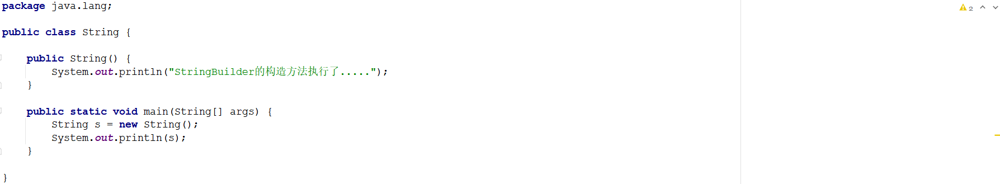
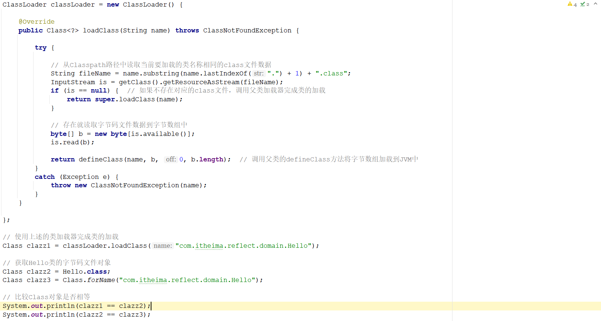

# 1 简答题

## 1.1 简答题一

简述类的加载过程？

```
答:
```

## 1.2 简答题二

简述(JDK8)类加载器的分类以及每一种类加载器所加载的类？

```
答：
```

## 1.3 简答题三

如下程序：

|  |
| ------------------------------------------------------------ |

上述程序执行完毕在控制台输出如下错误内容：

|  |
| ------------------------------------------------------------ |

请分析出现该错误的原因是什么？

```java
答：
```

## 1.4 简答题四

请分析如下程序在控制台输出的结果并说明原因？

|  |
| ------------------------------------------------------------ |

```
答：
```


## 1.5 简答题五

简述您对反射的理解以及使用反射的思想步骤？

```
答：
```


## 1.6 简答题六

简述获取一个类的字节码文件对象存在哪几种方式？

```
答：
```


# 2 编程题

## 2.1 编程题目一

**训练目标**：掌握反射代码书写，以及理解其在实际开发中的应用

**需求背景**：Java语言是面向对象的语言。要使用一个类，首先就需要创建类的对象，然后才可以调用类中的相关方法。但是如果每一次要使用这个类的时候都去创建一个全新的对象，那么就比较消耗内

存(每new一个对象都会在堆内存中开辟新的内存空间)。因此需要考虑对这一部分的代码进行优化，优化的思想：在程序启动的时候，创建一个对象，并且将这个对象存储到一个容器中，后期要使用该类

直接从容器中进行对象的获取即可。

|  |
| ------------------------------------------------------------ |

**需求描述**：在素材中reflect项目中的指定位置补全代码，使程序Entry可以正常运行。程序的运行效果如下所示：

|  |
| ------------------------------------------------------------ |

**实现提示**：

1、ClasspathApplicationContext构造方法

​	① 读取classpath路径下的applicationContext.properties文件中的内容到Properties集合中

​	② 遍历集合通过反射创建对应类的对象存储到beans集合中

3、getBean方法：遍历beans集合获取value的Class类型和传入的Class类型进行比对，如果相等直接返回该对象


## 2.2 编程题目二

**训练目标**：掌握自定义类加载器的代码书写，理解其在实际开发中的应用

**需求背景**："热加载"就是在不重启程序的情况下，让修改的代码可以立即生效。这样就可以大大的提高程序的测试效率。实现原理：当字节码文件修改了以后，重新加载该字节码文件到Jvm中。一般情况

​				 下，类的加载都是由系统自带的类加载器完成，且对于同一个全限定名的java类，只能被加载一次，而且很难被卸载。可以使用自定义的 ClassLoader 替换系统的加载器，创建一个新的 

​				 ClassLoader，再用它加载 Class，得到的 Class 对象就是新的（因为不是同一个类加载器），再用该 Class 对象创建一个实例，从而实现动态更新。

**需求描述**：在素材中的classload项目中指定位置补全代码，使程序Entry可以正常运行。程序的运行效果如下所示：

|  |
| ------------------------------------------------------------ |


**实现提示**：

1、开启两个线程

* 线程1：每间隔1秒对要热加载的源文件进行编译(已经实现)
* 线程2：每间隔1秒使用自定义类加载器加载需要热加载的class文件(部分代码已经实现)

2、通过自定义加载器加载指定的class文件到JVM中，并得到Class对象，通过反射执行所有的方法(只考虑无参数无返回值的方法)

3、自定义类加载器

* 继承ClassLoader类
* 重写loadClass方法
  * 判断是否是自定义的类，如果不是调用父类加载器的loadClass方法进行进行加载，如果是执行下一步操作
  * 通过流读取class文件数据，得到字节数组
  * 调用父类的defineClass方法将字节数组加载到JVM中


