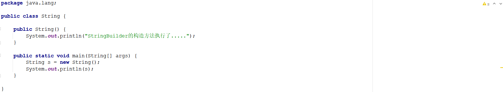
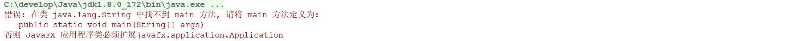
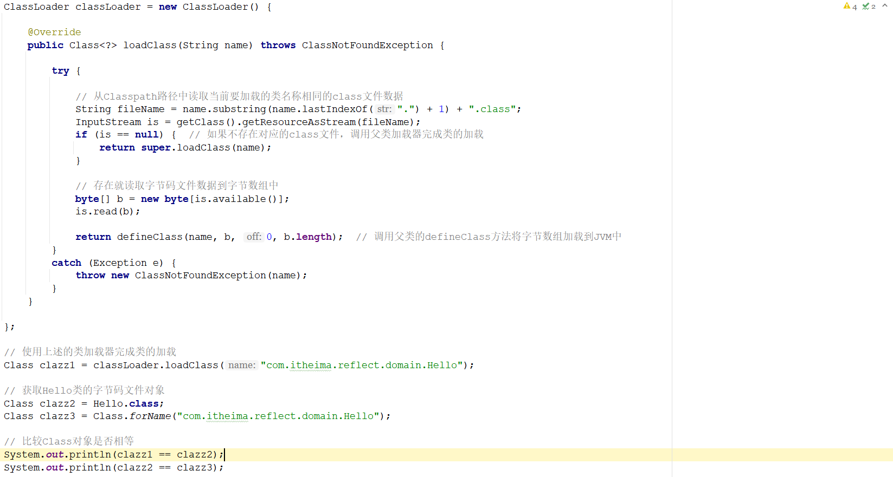
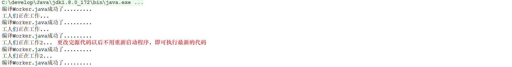

# 1 简答题

## 1.1 简答题一

简述类的加载过程？

```
答: 一个类被加载到虚拟机中需要经过如下几个过程：加载，验证，准备，解析和初始化。其中验证、准备、解析统称之为链接。如下图所示：
```

|  |
| ------------------------------------------------------------ |

```java
加载：”加载“是”类加载“过程的一个阶段，在加载阶段虚拟机需要完成以下3件事情：
	① 通过一个类的全限定名来获取定义此类的二进制字节流
	② 将这个字节流所代表的静态存储结构转化为运行时数据结构
	③ 在内存中生成一个代表这个类的java.lang.Class对象，任何类被使用时，系统都会为之建立一个 java.lang.Class 对象
验证：验证是链接阶段的第一步，这一阶段的目的是为了确保Class文件字节流中包含的信息符号当前虚拟机的要求，并且不会危害虚拟机自身安全
准备：负责为类的类变量（被static修饰的变量）分配内存，并设置默认初始化值
解析：将类的二进制数据流中的符号引用替换为直接引用
初始化：则根据程序员通过程序制定的主观计划去初始化类变量和其他资源。比如静态成员变量：private static int count = 23 ;
```

## 1.2 简答题二

简述(JDK8)类加载器的分类以及每一种类加载器所加载的类？

```
答：
① 启动类加载器（BootStrap ClassLoader）  ：它是虚拟机的内置类加载器，通过表示为null，用来加载 %JAVA_HOME%/jre/lib下的类, 如rt.jar中的class文件。
② 扩展类加载器（Extension Classloader）  ：它是平台类加载器； 用来加载 %JAVA_HOME%/jre/lib/ext 中的class文件。
③ 系统类加载器（AppClassLoader）         ：它被称为应用程序类加载器， 它负责加载用户类路径上所指定的类库，一般情况下这个就是程序中默认的类加载器
```

## 1.3 简答题三

如下程序：

|  |
| ------------------------------------------------------------ |

上述程序执行完毕在控制台输出如下错误内容：

|  |
| ------------------------------------------------------------ |

请分析出现该错误的原因是什么？

```shell
答：
当使用String类的时候，就需要将这个String类加载器到JVM中。系统类加载器先获取到加载这个类的请求，然后根据类加载器的双亲委派机制，系统类加载器会委托父类加载器(扩展内加载器)进行加载，扩展类加载器此时会委托其父类加载器(引导类加载器)进行加载，因为类加载器获取到这个请求以后，就开始从自己所负载的加载范围查找该类进行加载，由于上述程序所定义的String类和jdk中所提供的String类是同名同包的。因此引导类加载器就将JDK中的String类进行了加载，那么在Jdk中所提供的String类中是没有main方法的，因此控制台输出找不到main方法。
```

## 1.4 简答题四

请分析如下程序在控制台输出的结果并说明原因？

|  |
| ------------------------------------------------------------ |

```shell
答：
① 输出结果：false ， true
② 原因说明：决定一个类在JVM中的唯一性是由其类加载器和类的全限定名一同决定的。clazz1获取到的字节码文件对象是通过自定义的类加载器加载的，而clazz2和clazz3是通过系统类加载器(应用类加载器)加载的。因此在控制台输出的内容为：false ，true

验证代码如下所示：
```

```java
public class Hello {

    public static void main(String[] args) throws ClassNotFoundException {

        // 通过匿名内部类的方式创建一个ClassLoader对象
        ClassLoader classLoader = new ClassLoader() {

            @Override
            public Class<?> loadClass(String name) throws ClassNotFoundException {

                try {

                    // 从Classpath路径中读取当前要加载的类名称相同的class文件数据
                    String fileName = name.substring(name.lastIndexOf(".") + 1) + ".class";
                    InputStream is = getClass().getResourceAsStream(fileName);
                    if (is == null) {  // 如果不存在对应的class文件，调用父类加载器完成类的加载
                        return super.loadClass(name);
                    }

                    // 存在就读取字节码文件数据到字节数组中
                    byte[] b = new byte[is.available()];
                    is.read(b);

                    return defineClass(name, b, 0, b.length);  // 调用父类的defineClass方法将字节数组加载到JVM中
                }
                catch (Exception e) {
                    throw new ClassNotFoundException(name);
                }
            }

        };

        // 使用上述的类加载器完成类的加载
        Class clazz1 = classLoader.loadClass("com.itheima.reflect.domain.Hello");
        System.out.println(clazz1.getClassLoader());

        // 获取Hello类的字节码文件对象
        Class clazz2 = Hello.class;
        Class clazz3 = Class.forName("com.itheima.reflect.domain.Hello");
        System.out.println(clazz2.getClassLoader());
        System.out.println(clazz3.getClassLoader());

        // 比较Class对象是否相等
        System.out.println(clazz1 == clazz2);
        System.out.println(clazz2 == clazz3);

    }
}
```

控制台输出结果为：

|  |
| ------------------------------------------------------------ |

## 1.5 简答题五

简述您对反射的理解以及使用反射的思想步骤？

```
答：
① 反射的理解：反射的就是使用类的另外一种方式，通过这种方式使用类可以大大的提高程序的灵活性和后期的维护性
② 使用反射的思想步骤：
	1、获取指定的类的字节码文件对象
	2、调用字节码文件对象的方法获取构造方法对象(Constructor)、成员变量对象(Field)、成员方法对象(Method)
	3、调用构造方法对象的方法创建对象/调用成员变量对象的方法获取成员变量的值或者给成员变量赋值/调用成员方法对象的方法执行该方法
```


## 1.6 简答题六

简述获取一个类的字节码文件对象存在哪几种方式？

```
答：
① 使用类的静态class属性来获取该类对应的Class对象
② 调用对象的getClass()方法，返回该对象所属类对应的Class对象，该方法是Object类中的方法，所有的Java对象都可以调用该方法
③ 使用Class类中的静态方法forName(String className)，方法参数表示的是类的全限定名（带包名的类名）
```


# 2 编程题

## 2.1 编程题目一

**训练目标**：掌握反射代码书写，以及理解其在实际开发中的应用

**需求背景**：Java语言是面向对象的语言。要使用一个类，首先就需要创建类的对象，然后才可以调用类中的相关方法。但是如果每一次要使用这个类的时候都去创建一个全新的对象，那么就比较消耗内

存(每new一个对象都会在堆内存中开辟新的内存空间)。因此需要考虑对这一部分的代码进行优化，优化的思想：在程序启动的时候，创建一个对象，并且将这个对象存储到一个容器中，后期要使用该类

直接从容器中进行对象的获取即可。

|  |
| ------------------------------------------------------------ |

**需求描述**：在素材中reflect项目中的指定位置补全代码，使程序Entry可以正常运行。程序的运行效果如下所示：

|  |
| ------------------------------------------------------------ |

**实现提示**：

1、ClasspathApplicationContext构造方法

​	① 读取classpath路径下的applicationContext.properties文件中的内容到Properties集合中

​	② 遍历集合通过反射创建对应类的对象存储到beans集合中

3、getBean方法：遍历beans集合获取value的Class类型和传入的Class类型进行比对，如果相等直接返回该对象

**代码实现**：见《答案/代码/reflect》


## 2.2 编程题目二

**训练目标**：掌握自定义类加载器的代码书写，理解其在实际开发中的应用

**需求背景**："热加载"就是在不重启程序的情况下，让修改的代码可以立即生效。这样就可以大大的提高程序的测试效率。实现原理：当字节码文件修改了以后，重新加载该字节码文件到Jvm中。一般情况

​				下，类的加载都是由系统自带的类加载器完成，且对于同一个全限定名的java类，只能被加载一次，而且很难被卸载。可以使用自定义的 ClassLoader 替换系统的加载器，创建一个新的 

​				ClassLoader，再用它加载 Class，得到的 Class 对象就是新的（因为不是同一个类加载器），再用该 Class 对象创建一个实例，从而实现动态更新。

**需求描述**：在素材中的classload项目中指定位置补全代码，使程序Entry可以正常运行。程序的运行效果如下所示：

|  |
| ------------------------------------------------------------ |


**实现提示**：

1、开启两个线程

* 线程1：每间隔1秒对要热加载的源文件进行编译(已经实现)
* 线程2：每间隔1秒使用自定义类加载器加载需要热加载的class文件(部分代码已经实现)

2、通过自定义加载器加载指定的class文件到JVM中，并得到Class对象，通过反射执行所有的方法(只考虑无参数无返回值的方法)

3、自定义类加载器

* 继承ClassLoader类
* 重写loadClass方法
  * 判断是否是自定义的类，如果不是调用父类加载器的loadClass方法进行进行加载，如果是执行下一步操作
  * 通过流读取class文件数据，得到字节数组
  * 调用父类的defineClass方法将字节数组加载到JVM中

**代码实现**：见《答案/代码/classload》


