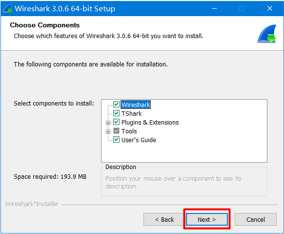

# 1. wireshark下载

我们可以在wireshark的公网去下载wireshark。官网地址：https://www.wireshark.org/download.html

 

下载完毕以后是一个exe的可执行程序。

 


# 2. wireshark安装

wireshark的安装几乎是傻瓜式安装(直接第一步下一步进行安装即可)。双击该exe程序

 

 

 

 

 

 

 

 

 

  

  

 

 

安装完毕以后就会产生一个虚拟网卡。

 

我们可以通过ipconfig命令来查看这个虚拟网卡所对应的ip地址

```java
以太网适配器 Npcap Loopback Adapter:

   连接特定的 DNS 后缀 . . . . . . . :
   本地链接 IPv6 地址. . . . . . . . : fe80::390f:5069:4f9a:aa06%42
   自动配置 IPv4 地址  . . . . . . . : 169.254.170.6	// 该ip地址可以表示本机，用于进行本地测试; 和本地回环地址127.0.0.1含义类似，
   子网掩码  . . . . . . . . . . . . : 255.255.0.0	 // 由于127.0.0.1这个地址上的数据较多不利于我们进行数据分析，因此后期我们使用的													        // 并不是很多
   默认网关. . . . . . . . . . . . . :

无线局域网适配器 WLAN:

   媒体状态  . . . . . . . . . . . . : 媒体已断开连接
   连接特定的 DNS 后缀 . . . . . . . : lan

以太网适配器 以太网:

   连接特定的 DNS 后缀 . . . . . . . :
   本地链接 IPv6 地址. . . . . . . . : fe80::24cf:c587:c97d:83de%19
   IPv4 地址 . . . . . . . . . . . . : 172.16.43.178
   子网掩码  . . . . . . . . . . . . : 255.255.192.0
   默认网关. . . . . . . . . . . . . : 172.16.0.1
```

# 3. wireshark使用

双击wireshark的exe程序，以管理员身份启动打开wireshark工具。如果监听不到网卡，请使用管理员打开doc窗口，执行: net start npf开启npf服务。

 

选择(双击即可)我们需要捕获数据的网卡。我们可以看到默认本地存在很多的数据传输过程。

 

按钮使用说明

 


我们也可以对这些数据进行过滤操作，过滤的语法：ip.src ==127.0.0.1 and tcp.port==8088 表示的意思就是过滤客户端的ip为127.0.0.1并且使用的是tcp协议进行通信，对应要

请求的服务端的端口号是8088


